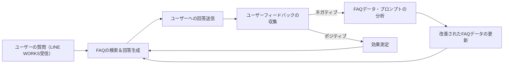

# 第5章：FAQチャットボットの実装 - 顧客対応を自動化する

この章では、LINE WORKSとClaude 3.7の連携を活用したFAQチャットボットの構築方法を解説します。FAQデータの準備から、ユーザーの問い合わせに対する類似度検索、自然な回答生成、さらにフィードバックループによる継続的な改善まで、実務に直結するノウハウをステップバイステップで紹介します。

---

## 5.1 FAQデータの準備：構造化されたデータの作成

### 概要と重要性

FAQチャットボットの精度は、まず高品質なFAQデータの準備にかかっています。LINE WORKSで受信したユーザーの問い合わせ内容と照合しやすいよう、質問と回答をペアにした構造化データを作成します。また、キーワードやカテゴリを設定することで、後続の類似度検索や回答生成の精度が向上します。

### FAQデータの基本構造例（JSON形式）

```json
[
  {
    "question": "送料はいくらですか？",
    "answer": "送料は、ご注文金額が5,000円以上の場合は無料です。5,000円未満の場合は全国一律500円となります。",
    "keywords": ["送料", "配送", "料金"],
    "category": "配送"
  },
  {
    "question": "返品・交換はできますか？",
    "answer": "商品到着後7日以内であれば、未使用品に限り返品・交換が可能です。",
    "keywords": ["返品", "交換", "キャンセル"],
    "category": "注文"
  },
  {
    "question": "支払い方法は何がありますか？",
    "answer": "クレジットカード、銀行振込、代金引換、コンビニ決済などがご利用いただけます。",
    "keywords": ["支払い", "決済", "方法"],
    "category": "支払い"
  }
]
```

### ポイント

- **質問のバリエーションを充実:** 同じ意味の問い合わせが異なる表現で送られるため、複数パターンを登録すると精度が向上します。  
- **キーワード・カテゴリの設定:** 検索エンジンの精度向上に直結し、ユーザーが意図するFAQを迅速に抽出可能にします。  
- **定期的な更新:** LINE WORKSでの問い合わせ状況に合わせて、FAQデータの見直しと更新を行います。

---

## 5.2 類似度検索：質問とFAQの最適なマッチング

### 概要と重要性

ユーザーがLINE WORKSで入力した質問と、構造化されたFAQデータ間の類似度を計算し、最も適切なFAQ候補を抽出することは、FAQチャットボットの中核機能です。ユーザーは完全に一致する質問を送る必要がなく、自然な表現でも高いマッチング精度が得られます。

### 基本的な実装例

以下のコード例では、PythonのTF-IDFとコサイン類似度を利用して、ユーザーの問い合わせとFAQデータの類似度を計算します。

```python
import json
import nltk
import numpy as np
from sklearn.feature_extraction.text import TfidfVectorizer
from sklearn.metrics.pairwise import cosine_similarity
import ssl

# SSLエラー対策（NLTK用）
try:
    _create_unverified_https_context = ssl._create_unverified_context
except AttributeError:
    pass
else:
    ssl._create_default_https_context = _create_unverified_https_context

# FAQデータの読み込み（ファイル名は適宜調整）
with open('faq_data.json', 'r', encoding='utf-8') as f:
    faq_data = json.load(f)

# FAQの質問リスト作成
faq_questions = [item['question'] for item in faq_data]

# TF-IDFベクトライザーの設定（英語の場合。日本語の場合は形態素解析等の前処理が必要）
vectorizer = TfidfVectorizer(analyzer='word', ngram_range=(1, 2), stop_words=nltk.corpus.stopwords.words('english'))
tfidf_matrix = vectorizer.fit_transform(faq_questions)

def find_similar_faq(question):
    """
    ユーザーの質問とFAQデータ間の類似度を計算し、最も類似度の高いFAQを返す。
    """
    question_vector = vectorizer.transform([question])
    similarity_scores = cosine_similarity(question_vector, tfidf_matrix)
    best_match_index = np.argmax(similarity_scores)
    if similarity_scores[0, best_match_index] < 0.2:  # 類似度の閾値
        return None
    return faq_data[best_match_index]

# LINE WORKSから受信した質問（例）
user_question = "How much does shipping cost?"
similar_faq = find_similar_faq(user_question)

if similar_faq:
    print("FAQ候補:", similar_faq['answer'])
else:
    print("類似するFAQが見つかりませんでした。")
```

### ポイント

- **ストップワード除去、ngram利用:** 英語の場合はNLTKのストップワードを除去、unigramとbigramを考慮する設定で類似度計算の精度を向上。  
- **日本語の場合:** 形態素解析ライブラリ（例：MeCab、Janomeなど）による前処理が必要です。  
- **類似度閾値の調整:** 類似度が低い場合は、FAQ候補が見つからないと判断し、他の対応（例：Claude 3.7による回答生成）を行います。

---

## 5.3 回答の生成：Claude 3.7による自然な回答

### 概要と重要性

類似度検索で抽出されたFAQ候補の回答に対して、さらにClaude 3.7を活用して自然な文章へと仕上げることで、ユーザーにとって読みやすく、かつ文脈に沿った回答を提供できます。LINE WORKSで受信したユーザーの質問と、FAQの回答情報を組み合わせたプロンプトをClaude 3.7に渡し、最終的な回答文を生成します。

### 基本的な実装例

以下のコードは、LINE WORKSで受信した質問とFAQ候補の回答をもとに、Claude 3.7 APIを使って最終回答を生成し、LINE WORKSへ送信する例です。

```python
import anthropic
import os
import json

# APIキー設定（環境変数から取得推奨）
ANTHROPIC_API_KEY = os.environ.get("CLAUDE_API_KEY")
client = anthropic.Anthropic(api_key=ANTHROPIC_API_KEY)

def generate_answer_with_claude(question, faq_answer):
    """
    Claude 3.7を利用して、FAQの回答をもとに自然な回答を生成する。
    """
    prompt = f"""以下の質問に対して、参考情報としてFAQの回答を利用し、丁寧かつ分かりやすい回答を作成してください。

質問: {question}

FAQの回答: {faq_answer}

回答:
"""
    try:
        response = client.messages.create(
            model="claude-3-opus-20240229",
            max_tokens=200,
            messages=[{"role": "user", "content": prompt}]
        )
        # 応答内容を抽出（APIレスポンスの形式に合わせて調整）
        return response.content[0].text
    except Exception as e:
        print(f"エラーが発生しました: {e}")
        return "申し訳ありません。回答を生成できませんでした。"

# 例：LINE WORKSから受信した質問と、類似度検索で見つかったFAQ候補（見つからない場合はデフォルト回答を設定）
user_question = "How much does shipping cost?"
if similar_faq:
    faq_answer = similar_faq['answer']
else:
    faq_answer = "送料は、ご注文金額が5,000円以上の場合は無料、5,000円未満の場合は全国一律500円です。"

# Claude 3.7で回答生成
generated_answer = generate_answer_with_claude(user_question, faq_answer)

# LINE WORKSへの送信関数（既存の実装を利用）
def send_message_to_line_works(message):
    # ここにLINE WORKS APIでメッセージ送信する実装を記述
    print("LINE WORKSへの送信:", message)

# 生成された回答をLINE WORKSへ送信
send_message_to_line_works(generated_answer)

print("質問:", user_question)
print("生成された回答:", generated_answer)
```

### ポイント

- **プロンプト設計:** FAQの回答情報とユーザーの質問を統合したプロンプトを作成し、Claude 3.7に渡すことで、より自然な文章を生成します。  
- **パラメータ調整:** `max_tokens`や`temperature`の値で出力の長さや創造性を調整可能。  
- **エラーハンドリング:** APIエラー発生時の対策も実装し、システムの安定性を確保します。

---

## 5.4 フィードバックループ：回答の精度を継続的に向上させる

### 概要と重要性

FAQチャットボットは構築後もユーザーのフィードバックを反映して改善することが重要です。LINE WORKS上でのやり取りの中からフィードバックを収集し、FAQデータやプロンプトの改善に活用することで、チャットボットの回答精度や顧客満足度が向上します。

### フィードバックループの基本プロセス



### ポイント

- **フィードバック収集:** LINE WORKSのチャット画面上に評価ボタンやコメント入力を用意し、ユーザーからのフィードバックを収集。  
- **定量的・定性的分析:** 回答の正確性、分かりやすさ、速度などをカテゴリ分けし、改善すべき点を特定。  
- **定期的な改善:** フィードバックに基づいてFAQデータやプロンプトを更新し、チャットボットのパフォーマンスを向上。

---

## まとめと次のステップ

本章では、LINE WORKSとClaude 3.7の連携を前提としたFAQチャットボットの実装方法について、以下の内容を解説しました。

1. **FAQデータの準備:** 顧客対応に必要な情報を構造化し、検索精度と保守性を向上。  
2. **類似度検索:** ユーザーの問い合わせとFAQデータ間の類似度を計算し、最適なFAQ候補を抽出。  
3. **回答生成:** Claude 3.7を用いて、FAQ候補をもとに自然な回答文を生成し、LINE WORKS経由でユーザーに提供。  
4. **フィードバックループ:** ユーザーフィードバックを収集・分析し、FAQデータやプロンプトの改善に反映する仕組みを構築。

これらの技術を統合することで、LINE WORKS上で顧客対応を自動化し、業務効率と顧客満足度を大幅に向上させるFAQチャットボットが実現できます。今後は、各プロセスの詳細なチューニングや運用の自動化など、さらなる拡張を検討してください。