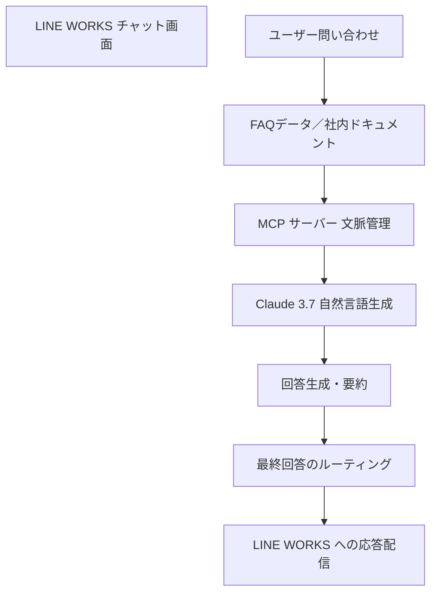

# 第6章：社内ナレッジ共有チャットボットの実装  

## 6.1 はじめに

企業内には、マニュアル、議事録、FAQ、各種レポートなど、膨大な社内ナレッジが散在しています。これらの情報は、従業員が業務を進める上で極めて重要ですが、形式が統一されていないため、必要な情報を迅速に抽出できず、知識の活用が十分に行われないという課題があります。

そこで本章では、LINE WORKSをフロントエンドとして、Claude 3.7の高度な自然言語処理能力と、MCP（Model Context Protocol）を用いた文脈管理機構を連携することで、以下のことを実現するシステムの構築手法を解説します。

- **社内文書の自動収集と整理**  
  各種情報源（ファイルサーバー、SharePoint、Confluence など）から文書を自動収集し、メタデータ付与によって一元管理する。

- **テキスト抽出と前処理**  
  PDF、Word、Webページなどの各種文書からテキストを抽出し、不要な文字や空白の除去、正規化を実施する。

- **インデックス作成と高速検索**  
  Elasticsearch などの検索エンジンを用いて抽出したテキストデータをインデックス化し、関連性の高い情報検索を実現する。

- **検索結果の表示と自然な回答生成**  
  検索結果をLINE WORKS上でわかりやすく提示し、Claude 3.7 を利用して検索結果の要約や補完を行う。さらに MCP により各工程間で文脈情報を一元管理し、回答の一貫性を保つ。

- **統合運用による多チャネル展開**  
  MCPを活用することで、LINE WORKSのみならず、社内ポータルやモバイルアプリなど他チャネルへの情報配信も柔軟に実施する。

以下、各セクションごとに具体的な実装例とその解説を示します。

---

## 6.2 社内ドキュメントの収集と整理

### 6.2.1 概要

まず、社内に散在する各種文書（Word、PDF、テキスト、Webページなど）を一元的に収集・整理する必要があります。これにより、後続のテキスト抽出や検索処理で、網羅的かつ最新のナレッジを利用できるようになります。また、文書ごとにタイトル、作成者、作成日、キーワード、カテゴリなどのメタデータを付与することで、検索結果の精度向上にも寄与します。

### 6.2.2 収集方法と実装例

#### 自動収集スクリプト

Python を用いて、指定ディレクトリ内の文書ファイル（PDF、Word、テキスト）を自動的に走査・収集する例です。

```python
import os

def collect_documents(directory: str) -> list[str]:
    """
    指定されたディレクトリからPDF、Word、テキストファイルを収集する。
    """
    documents = []
    for filename in os.listdir(directory):
        if filename.endswith((".pdf", ".docx", ".txt")):
            filepath = os.path.join(directory, filename)
            documents.append(filepath)
    return documents

# 例：特定ディレクトリからドキュメントを収集
directory_path = "/path/to/your/documents"
collected_docs = collect_documents(directory_path)
print("収集されたドキュメント:", collected_docs)
```

#### API連携による文書収集

SharePoint や Confluence など、API により文書を取得できるシステムからの収集は、各サービスのドキュメントに沿って認証情報を用い、自動化することが推奨されます。

#### メタデータ付与の工夫

収集した文書から内容を抽出し、spaCy などを利用してキーワードを自動抽出、タイトルや作成者情報をメタデータとして付与します。

```python
import spacy
nlp = spacy.load("ja_core_news_sm")

def extract_keywords(text: str) -> list[str]:
    """
    テキストから名詞・形容詞をキーワードとして抽出する。
    """
    doc = nlp(text)
    keywords = [token.text for token in doc if token.pos_ in ["NOUN", "ADJ"]]
    return keywords

# 例：文書内容からキーワード抽出
sample_text = "このドキュメントは、社内ナレッジ共有チャットボットの実装について詳細に解説しています。"
keywords = extract_keywords(sample_text)
print("抽出されたキーワード:", keywords)
```

---

## 6.3 テキスト抽出と前処理

### 6.3.1 概要

文書収集後は、各種ファイル形式からテキストを抽出し、Claude 3.7 などが利用できる統一フォーマットに変換します。これにより、自然言語処理やインデックス作成での精度が向上します。

### 6.3.2 各種ファイル形式からのテキスト抽出

#### PDF のテキスト抽出

```python
from pdfminer.high_level import extract_text

def extract_text_from_pdf(pdf_path: str) -> str | None:
    """
    PDFファイルからテキストを抽出する関数
    """
    try:
        return extract_text(pdf_path)
    except Exception as e:
        print("PDF抽出エラー:", e)
        return None

# 例：PDFファイルからテキスト抽出
pdf_file = "/path/to/document.pdf"
pdf_text = extract_text_from_pdf(pdf_file)
if pdf_text:
    print("抽出されたPDFテキスト:", pdf_text[:200])
```

#### Word 文書からのテキスト抽出

```python
from docx import Document

def extract_text_from_docx(docx_path: str) -> str | None:
    """
    Word文書からテキストを抽出する関数
    """
    try:
        doc = Document(docx_path)
        paragraphs = [p.text for p in doc.paragraphs]
        return "\n".join(paragraphs)
    except Exception as e:
        print("Word抽出エラー:", e)
        return None

# 例：Word文書からテキスト抽出
docx_file = "/path/to/document.docx"
docx_text = extract_text_from_docx(docx_file)
if docx_text:
    print("抽出されたWordテキスト:", docx_text[:200])
```

#### HTML/Web ページからのテキスト抽出

```python
import requests
from bs4 import BeautifulSoup

def extract_text_from_web(url: str) -> str | None:
    """
    Webページからテキストを抽出する関数
    """
    try:
        response = requests.get(url)
        response.raise_for_status()
        soup = BeautifulSoup(response.text, "html.parser")
        return soup.get_text(separator="\n")
    except Exception as e:
        print("Web抽出エラー:", e)
        return None

# 例：Webページからテキスト抽出
web_url = "https://example.com"
web_text = extract_text_from_web(web_url)
if web_text:
    print("抽出されたWebテキスト:", web_text[:200])
```

### 6.3.3 テキスト前処理

抽出したテキストデータには不要な記号や改行が含まれている場合があるため、正規表現を用いて前処理を行い、クリーンなデータに整形します。

```python
import re

def preprocess_text(text: str) -> str:
    """
    テキストデータの前処理：不要な文字列の削除・正規化を行う
    """
    # 日本語と英数字、空白は残し、その他の記号を削除
    text = re.sub(r"[^ぁ-んァ-ン一-龥a-zA-Z0-9\s]", "", text)
    text = re.sub(r"\s+", " ", text)
    return text.strip()

# 例：抽出したテキストの前処理
raw_text = "　This is a Sample Text!　"
clean_text = preprocess_text(raw_text)
print("前処理後のテキスト:", clean_text)
```

---

## 6.4 インデックス作成と高速検索

### 6.4.1 概要

抽出したテキストデータをそのまま扱うと、膨大な情報から目的の内容を迅速に検索するのは困難です。Elasticsearch などの検索エンジンを利用し、抽出テキストのインデックスを作成することで、高速かつ関連性の高い検索を実現します。さらに、このインデックスは、Claude 3.7 の文脈補完時の入力情報としても利用されます。

### 6.4.2 Elasticsearch を利用したインデックス作成の実装例

```python
from elasticsearch import Elasticsearch

# Elasticsearchへの接続設定
es = Elasticsearch([{'host': 'localhost', 'port': 9200}])
index_name = "internal_knowledge_index"

# インデックスが存在しない場合は作成
if not es.indices.exists(index=index_name):
    es.indices.create(index=index_name, ignore=400)

def index_document(document_id: int, title: str, content: str) -> None:
    """
    ドキュメントのタイトルと内容をElasticsearchにインデックスする
    """
    try:
        doc = {"title": title, "content": content}
        res = es.index(index=index_name, id=document_id, document=doc)
        print(f"ドキュメント {document_id} をインデックス: {res['result']}")
        es.indices.refresh(index=index_name)
    except Exception as e:
        print("インデックス作成エラー:", e)

# 例：ドキュメントをインデックスに追加
document_id = 1
document_title = "社内ナレッジ共有チャットボットの実装"
document_content = "このドキュメントは、社内ナレッジ共有チャットボットの実装方法について詳細に解説しています。"
index_document(document_id, document_title, document_content)
```

### 6.4.3 検索結果の表示

検索クエリを実行し、取得した検索結果をユーザーに見やすい形式（リストやカード形式）で表示する実装例です。

```python
def display_search_results(results: dict) -> None:
    """
    Elasticsearchから取得した検索結果をリスト形式で表示する
    """
    if not results or results["hits"]["total"]["value"] == 0:
        print("検索結果は見つかりませんでした。")
        return

    print("検索結果:")
    for hit in results["hits"]["hits"]:
        title = hit["_source"]["title"]
        excerpt = hit["_source"]["content"][:100]
        score = hit["_score"]
        print(f"タイトル: {title}")
        print(f"内容抜粋: {excerpt}...")
        print(f"スコア: {score}")
        print("-" * 20)

# 例：検索実行と結果表示
search_term = "社内ナレッジ"
results = es.search(index=index_name, query={"match": {"content": search_term}})
display_search_results(results)
```

また、検索キーワードに該当する部分をハイライト表示する機能も実装可能です。

```python
def highlight_search_results(search_term: str, content: str) -> str:
    """
    テキスト中の検索キーワードをハイライト表示する
    """
    return content.replace(search_term, f"**{search_term}**")

# 例：ハイライト表示
sample_content = "このドキュメントは、社内ナレッジ共有チャットボットの実装について解説しています。"
highlighted = highlight_search_results("チャットボット", sample_content)
print("ハイライト表示例:", highlighted)
```

---

## 6.5 LINE WORKS × Claude 3.7 × MCP 統合運用

### 6.5.1 統合の意義

LINE WORKSは企業内コミュニケーションの主要窓口として機能し、Claude 3.7 は高度な自然言語処理により問い合わせの文脈を解析し、自然な回答を生成します。さらに、MCP（Model Context Protocol）を活用することで、各工程間で文脈情報を統一的に管理し、より一貫性のある回答生成が可能になります。これにより、従来の静的なFAQシステムでは得られなかった動的な回答生成と情報共有が実現されます。

### 6.5.2 統合処理の全体フロー

以下の図は、LINE WORKS、Claude 3.7、MCP が連携して動作するシステム構成を示しています。



### 6.5.3 統合処理の実装例

以下は、MCP Python SDK を活用し、LINE WORKS と Claude 3.7 の連携環境における統合処理のコード例です。  
このコードは、ユーザーからの問い合わせに対して FAQ データから生回答を取得し、MCP により文脈情報を取得した上で Claude 3.7 に渡し、補完回答を生成。最終的に MCP 経由で LINE WORKS に送信する一連の流れを示しています。

```python
import os
import time
import random
import logging
import asyncio
from mcp import ClientSession, StdioServerParameters
from mcp.client.stdio import stdio_client

logging.basicConfig(level=logging.INFO, format="%(asctime)s - %(levelname)s - %(message)s")

# --- 環境設定と構成クラス ---
class Configuration:
    """MCP クライアントの環境変数と設定ファイルの管理"""

    def __init__(self) -> None:
        self.load_env()
        self.api_key = os.getenv("LLM_API_KEY")

    @staticmethod
    def load_env() -> None:
        from dotenv import load_dotenv
        load_dotenv()

    @staticmethod
    def load_config(file_path: str) -> dict:
        with open(file_path, "r") as f:
            return json.load(f)

    @property
    def llm_api_key(self) -> str:
        if not self.api_key:
            raise ValueError("LLM_API_KEY not found in environment variables")
        return self.api_key

# --- FAQデータベース（生回答） ---
FAQ_DATABASE = {
    "shipping_cost": "送料は、ご注文金額が5,000円以上の場合は無料、5,000円未満の場合は全国一律500円です。"
}

# --- Claude 3.7 連携（模擬実装） ---
def call_claude_for_enhancement(user_query: str, raw_answer: str, context: dict = None) -> str:
    """
    Claude 3.7 API を模して、生回答に対して文脈補完・自然な文章生成を行う関数
    MCP による文脈情報も利用する
    """
    logging.info("Claude 3.7 へのリクエスト開始...")
    if context:
        logging.info("MCP: 受信した文脈情報: " + str(context))
    time.sleep(random.uniform(0.5, 1.0))  # 模擬的な待機
    enriched_answer = (
        f"{raw_answer} さらに、最新の社内キャンペーンにより一部地域では特別割引が適用される可能性があります。"
        " 詳細は社内ポータルをご確認ください。"
    )
    logging.info("Claude 3.7 からの応答取得完了")
    return enriched_answer

# --- MCP を利用した文脈情報取得の模擬関数 ---
def get_model_context(user_id: str) -> dict:
    """
    ユーザーごとの過去の問い合わせや文脈情報を MCP を通じて取得する模擬実装
    """
    context = {"last_query": "Previous inquiry about shipping cost"}
    logging.info("MCP: 文脈情報を取得: " + str(context))
    return context

# --- MCP を利用したメッセージルーティング（模擬実装） ---
def mcp_route_message(message: str, channel: str = "LINE_WORKS") -> bool:
    """
    MCP (Model Context Protocol) を利用して、最終回答メッセージを指定チャネルへ配信する
    """
    logging.info(f"MCP: メッセージを {channel} にルーティング中...")
    time.sleep(0.3)
    logging.info(f"MCP: {channel} へのメッセージ送信完了")
    return True

# --- LLM クライアント ---
class LLMClient:
    """LLM プロバイダーとの通信を管理するクライアント"""

    def __init__(self, api_key: str) -> None:
        self.api_key = api_key

    def get_response(self, messages: list[dict]) -> str:
        """
        LLM からの応答を取得する（ここでは模擬的な実装）
        """
        # 本来は httpx などで実際の LLM API に問い合わせる
        simulated_response = "Simulated LLM response based on messages."
        return simulated_response

# --- MCP クライアントと対話を統括するチャットセッション ---
class ChatSession:
    """ユーザー、MCP サーバー、LLM クライアント間の対話を管理する"""

    def __init__(self, servers: list, llm_client: LLMClient) -> None:
        self.servers = servers
        self.llm_client = llm_client

    async def cleanup_servers(self) -> None:
        cleanup_tasks = [asyncio.create_task(server.cleanup()) for server in self.servers]
        if cleanup_tasks:
            await asyncio.gather(*cleanup_tasks, return_exceptions=True)

    async def process_llm_response(self, llm_response: str) -> str:
        try:
            import json
            tool_call = json.loads(llm_response)
            if "tool" in tool_call and "arguments" in tool_call:
                logging.info(f"Executing tool: {tool_call['tool']}")
                for server in self.servers:
                    tools = await server.list_tools()
                    if any(tool.name == tool_call["tool"] for tool in tools):
                        try:
                            result = await server.execute_tool(tool_call["tool"], tool_call["arguments"])
                            return f"Tool execution result: {result}"
                        except Exception as e:
                            error_msg = f"Error executing tool: {str(e)}"
                            logging.error(error_msg)
                            return error_msg
                return f"No server found with tool: {tool_call['tool']}"
            return llm_response
        except json.JSONDecodeError:
            return llm_response

    async def start(self) -> None:
        try:
            for server in self.servers:
                try:
                    await server.initialize()
                except Exception as e:
                    logging.error(f"Failed to initialize server: {e}")
                    await self.cleanup_servers()
                    return

            all_tools = []
            for server in self.servers:
                tools = await server.list_tools()
                all_tools.extend(tools)

            tools_description = "\n".join([tool.format_for_llm() for tool in all_tools])
            system_message = (
                "You are a helpful assistant with access to these tools:\n\n"
                f"{tools_description}\n\n"
                "When you need to use a tool, respond with the exact JSON format:\n"
                '{ "tool": "tool-name", "arguments": { "argument-name": "value" } }\n\n'
                "Otherwise, reply directly."
            )
            messages = [{"role": "system", "content": system_message}]

            while True:
                try:
                    user_input = input("You: ").strip()
                    if user_input.lower() in ["quit", "exit"]:
                        logging.info("Exiting...")
                        break

                    messages.append({"role": "user", "content": user_input})
                    llm_response = self.llm_client.get_response(messages)
                    logging.info("Assistant: %s", llm_response)

                    result = await self.process_llm_response(llm_response)
                    if result != llm_response:
                        messages.append({"role": "assistant", "content": llm_response})
                        messages.append({"role": "system", "content": result})
                        final_response = self.llm_client.get_response(messages)
                        logging.info("Final response: %s", final_response)
                        messages.append({"role": "assistant", "content": final_response})
                    else:
                        messages.append({"role": "assistant", "content": llm_response})
                except KeyboardInterrupt:
                    logging.info("Exiting...")
                    break
        finally:
            await self.cleanup_servers()

# --- Server クラス（前述の説明に基づく MCP サーバー管理クラス） ---
class Server:
    """MCP サーバーとの接続およびツール実行を管理する"""

    def __init__(self, name: str, config: dict) -> None:
        self.name = name
        self.config = config
        self.stdio_context = None
        self.session = None
        self._cleanup_lock = asyncio.Lock()
        from contextlib import AsyncExitStack
        self.exit_stack = AsyncExitStack()

    async def initialize(self) -> None:
        """MCP サーバーとの接続を初期化する"""
        import shutil
        command = (
            shutil.which("npx")
            if self.config.get("command") == "npx"
            else self.config.get("command")
        )
        if command is None:
            raise ValueError("The command must be a valid string.")

        from mcp.client.stdio import stdio_client
        from mcp import ClientSession, StdioServerParameters
        server_params = StdioServerParameters(
            command=command,
            args=self.config.get("args"),
            env={**os.environ, **self.config.get("env", {})},
        )
        try:
            stdio_transport = await self.exit_stack.enter_async_context(stdio_client(server_params))
            read, write = stdio_transport
            session = await self.exit_stack.enter_async_context(ClientSession(read, write))
            await session.initialize()
            self.session = session
        except Exception as e:
            logging.error(f"Error initializing server {self.name}: {e}")
            await self.cleanup()
            raise

    async def list_tools(self) -> list:
        """利用可能なツールの一覧を取得する"""
        if not self.session:
            raise RuntimeError(f"Server {self.name} not initialized")
        tools_response = await self.session.list_tools()
        tools = []
        for item in tools_response:
            if isinstance(item, tuple) and item[0] == "tools":
                for tool in item[1]:
                    tools.append(Tool(tool.name, tool.description, tool.inputSchema))
        return tools

    async def execute_tool(self, tool_name: str, arguments: dict, retries: int = 2, delay: float = 1.0) -> Any:
        """指定したツールを実行する（リトライ機構付き）"""
        if not self.session:
            raise RuntimeError(f"Server {self.name} not initialized")
        attempt = 0
        while attempt < retries:
            try:
                logging.info(f"Executing {tool_name}...")
                result = await self.session.call_tool(tool_name, arguments)
                return result
            except Exception as e:
                attempt += 1
                logging.warning(f"Error executing tool: {e}. Attempt {attempt} of {retries}.")
                if attempt < retries:
                    logging.info(f"Retrying in {delay} seconds...")
                    await asyncio.sleep(delay)
                else:
                    logging.error("Max retries reached. Failing.")
                    raise
    async def cleanup(self) -> None:
        """接続リソースをクリーンアップする"""
        async with self._cleanup_lock:
            try:
                await self.exit_stack.aclose()
                self.session = None
                self.stdio_context = None
            except Exception as e:
                logging.error(f"Error during cleanup of server {self.name}: {e}")

# --- Tool クラス ---
class Tool:
    """サーバー上のツールの情報を保持する"""

    def __init__(self, name: str, description: str, input_schema: dict) -> None:
        self.name = name
        self.description = description
        self.input_schema = input_schema

    def format_for_llm(self) -> str:
        """ツール情報を LLM 用にフォーマットする"""
        args_desc = []
        if "properties" in self.input_schema:
            for param_name, param_info in self.input_schema["properties"].items():
                arg_desc = f"- {param_name}: {param_info.get('description', '説明なし')}"
                if param_name in self.input_schema.get("required", []):
                    arg_desc += " (必須)"
                args_desc.append(arg_desc)
        return f"ツール: {self.name}\n説明: {self.description}\n引数:\n{chr(10).join(args_desc)}"

# --- メイン処理 ---
async def main() -> None:
    config = Configuration()
    server_config = config.load_config("servers_config.json")
    servers = [Server(name, srv_config) for name, srv_config in server_config["mcpServers"].items()]
    llm_client = LLMClient(config.llm_api_key)
    chat_session = ChatSession(servers, llm_client)
    await chat_session.start()

if __name__ == "__main__":
    asyncio.run(main())
```

---

## 6.6 まとめと今後の展望

本章では、LINE WORKSをフロントエンドとし、Claude 3.7の自然言語処理能力およびMCP（Model Context Protocol）を活用して社内ナレッジ共有チャットボットを構築するための一連の工程について解説しました。以下の点が主な成果です。

- **文書収集と整理:**  
  各種情報源から自動収集し、メタデータ付与を通じてナレッジを一元管理することで、常に最新の情報を活用可能な基盤を構築しました。

- **テキスト抽出と前処理:**  
  PDF、Word、Webページなどからテキストを抽出し、不要な文字や改行を正規表現で除去することで、Claude 3.7にとって扱いやすいクリーンなデータを生成しました。

- **インデックス作成と高速検索:**  
  Elasticsearchを用いたインデックス作成により、大量の文書から迅速に関連情報を検索できるシステムを実現し、検索精度および速度を大幅に向上させました。

- **検索結果の表示と自然な回答生成:**  
  検索結果をリスト形式やカード形式で分かりやすく表示するとともに、Claude 3.7の補完機能により、FAQやドキュメントの内容を文脈に即した自然な回答へと変換しました。

- **MCPによる文脈管理と統合運用:**  
  MCPを導入することで、各工程間でユーザーの問い合わせ履歴や内部文書から抽出した文脈情報を統一的に管理し、Claude 3.7へのプロンプトに反映することで、回答の一貫性と精度を向上させました。また、MCPを活用することで、LINE WORKSだけでなく他チャネルへの情報配信も柔軟に行える体制が整いました。

### 今後の展望

本システムは、以下の拡張によりさらに進化する可能性を秘めています。

- **自動学習機能の導入:**  
  ユーザーからのフィードバックや対話ログを活用し、FAQデータや回答生成プロンプトを自動で改善する仕組みを構築することで、システムが継続的に進化します。

- **パーソナライズド検索の実現:**  
  ユーザーの部署、役職、過去の問い合わせ履歴に応じた個別最適化された検索結果を提供することで、各従業員に最も relevant な情報を届ける仕組みの構築が期待されます。

- **多言語対応:**  
  Claude 3.7 の多言語処理能力を活用し、国際的な企業環境においても社内ナレッジ共有が円滑に行えるよう、翻訳機能や多言語検索機能を強化します。

- **統合ダッシュボードの実装:**  
  LINE WORKS上でチャットボットの運用状況、検索ログ、フィードバックをリアルタイムで監視・管理できるダッシュボードを構築し、運用の最適化を図ります。

- **セキュリティ・アクセス制御の強化:**  
  社内ナレッジは非常に重要な情報資産であるため、アクセス権管理、ログ監査、データ暗号化などのセキュリティ対策を徹底し、安全な運用環境を実現します。

---

## 結論

本章では、LINE WORKSとClaude 3.7、さらにMCP（Model Context Protocol）を統合した社内ナレッジ共有チャットボットの構築方法について、以下の主要工程を詳細に解説しました。

1. **社内文書の収集と整理**  
   自動収集スクリプトやAPI連携を活用して、各種社内情報源から文書を収集し、メタデータ付与により一元管理する方法。

2. **テキスト抽出と前処理**  
   PDF、Word、Webページなどからテキストを抽出し、正規表現などを用いて不要な文字列を除去、クリーンなテキストデータに変換する手法。

3. **インデックス作成と高速検索**  
   Elasticsearch を利用して抽出テキストのインデックスを作成し、関連性の高い検索を実現する仕組みの構築。

4. **検索結果の表示と回答生成**  
   LINE WORKS上で検索結果を分かりやすく提示するとともに、Claude 3.7 の自然言語処理機能を用いて、文脈に即した自然な回答を生成する方法。

5. **MCPによる文脈管理と統合運用**  
   MCP を活用して各工程間で文脈情報を統一的に管理し、Claude 3.7 へのプロンプトに反映することで、回答の一貫性と精度を向上させるとともに、複数チャネルへの配信を実現する仕組み。

これらの技術と実装例を統合することで、従来の静的なFAQシステムを超えた、動的かつ文脈に即した社内ナレッジ共有チャットボットが実現され、従業員の情報アクセス効率と業務生産性が大幅に向上することが期待されます。  
今後は、ユーザーからのフィードバックを反映した自動学習機能、パーソナライズドな検索、さらには多言語対応の拡張により、システム全体のさらなる進化が期待されます。

---

【参考情報】

- **LINE WORKS API:** 企業向けコミュニケーションプラットフォームとして、チャットボットのメッセージ送受信、認証、ユーザー管理など豊富なAPI機能を提供します。  
- **Claude 3.7:** Anthropicが提供する最新の自然言語処理モデルで、文脈理解、創造的なテキスト生成、FAQ補完、文書要約、翻訳など幅広い用途に対応します。  
- **MCP (Model Context Protocol):** 各工程間で文脈情報を統一的に管理し、LLMとの連携を高精度に実現するプロトコル。MCP Python SDK により、リソース、ツール、プロンプトの管理が標準化され、システム全体で一貫性が保たれます。

---

この再構成した第6章を通じ、LINE WORKSとClaude 3.7、MCP を連携することで、従来の静的FAQでは実現できなかった動的な情報検索と回答生成が可能になることを証明するとともに、実運用環境への応用例を詳細に示しました。各工程の実装例や統合手法を参考に、実際の社内ナレッジ共有システムの構築にお役立てください。