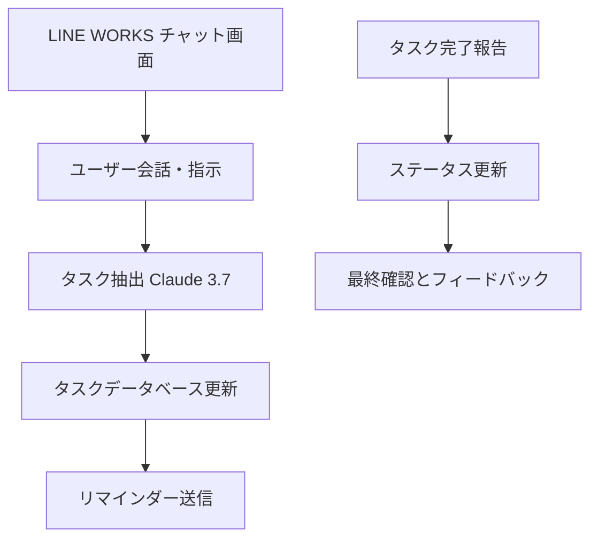

# 第8章：タスク管理とリマインダーの自動化 - 生産性を最大化する

## 8.1 タスクの抽出：会話からタスクを自動認識する

### 8.1.1 概要と重要性

会議、チャット、メールなど、日々のコミュニケーションの中には多くのタスクが潜んでいます。LINE WORKSを利用した社内チャットでは、従来は手動でタスクを整理していましたが、Claude 3.7の高精度な自然言語処理を活用することで、会話から自動的にタスクを抽出し、見落としなく管理することが可能になります。  
これにより、担当者は重要なタスクに迅速に対応でき、業務効率が大幅に向上します。

### 8.1.2 タスク抽出の実装例

以下は、Pythonの自然言語処理ライブラリ（spaCyとtransformers）を利用して、会話テキストからタスクを抽出する基本例です。  
※ 本例は英語モデルの利用例ですが、日本語モデルに変更すれば日本語会話にも対応可能です。

```python
import spacy
from transformers import pipeline

# spaCyの言語モデルのロード（英語の場合 "en_core_web_sm"、日本語の場合 'ja_core_news_sm' など）
nlp = spacy.load("en_core_web_sm")
# 要約パイプラインの初期化（例としてFacebookのBartを使用）
summarizer = pipeline("summarization", model="facebook/bart-large-cnn")

def extract_tasks(conversation: str) -> list[str]:
    """会話テキストからタスクを抽出する関数"""
    doc = nlp(conversation)
    tasks = []
    for sent in doc.sents:
        if any(keyword in sent.text.lower() for keyword in ["must", "need to", "should"]):
            tasks.append(sent.text)
        else:
            summary = summarizer(sent.text, max_length=30, min_length=10, do_sample=False)[0]['summary_text']
            if any(keyword in summary.lower() for keyword in ["need", "must"]):
                tasks.append(summary)
    return tasks

# 例：会話テキストからタスク抽出
conversation = """
Team, we need to finish the design by tomorrow.
Also, John should prepare the presentation for next week's meeting.
Please check the client emails and respond promptly.
"""
tasks = extract_tasks(conversation)
print("抽出されたタスク:")
for task in tasks:
    print(f"- {task}")
```

### 8.1.3 実践的なポイント

- **キーワードや依存関係解析のカスタマイズ:** チームの業務に合わせたキーワードの追加、spaCyの依存関係解析で発言者やアクションの主体を特定する。
- **モデルのファインチューニング:** 特定ドメイン向けのデータセットでモデルをチューニングすることで、抽出精度を向上可能です。

---

## 8.2 タスクの管理：データベースまたはスプレッドシートでタスク管理

### 8.2.1 概要と重要性

抽出したタスクを効果的に管理するためには、構造化されたデータベースまたはスプレッドシートでタスク情報（説明、担当者、期日、ステータスなど）を管理することが不可欠です。これにより、タスクの進捗や優先度、完了状況をリアルタイムで把握し、適切なフォローアップが可能になります。

### 8.2.2 SQLiteを利用したタスク管理の実装例

以下は、SQLiteを使ってタスクの登録、一覧表示、ステータス更新を行う例です。

```python
import sqlite3

# データベースへの接続とテーブル作成
conn = sqlite3.connect('tasks.db')
cursor = conn.cursor()
cursor.execute('''
    CREATE TABLE IF NOT EXISTS tasks (
        id INTEGER PRIMARY KEY AUTOINCREMENT,
        description TEXT NOT NULL,
        assignee TEXT,
        due_date TEXT,
        status TEXT DEFAULT '未着手'
    )
''')

def create_task(description: str, assignee: str = None, due_date: str = None) -> None:
    """タスクをデータベースに登録する"""
    cursor.execute('''
        INSERT INTO tasks (description, assignee, due_date)
        VALUES (?, ?, ?)
    ''', (description, assignee, due_date))
    conn.commit()
    print(f"タスク '{description}' を登録しました。")

def list_tasks() -> None:
    """登録されているタスクを一覧表示する"""
    cursor.execute('SELECT * FROM tasks')
    tasks = cursor.fetchall()
    if not tasks:
        print("タスクは登録されていません。")
        return
    print("タスク一覧:")
    for task in tasks:
        print(f"- ID: {task[0]}, 説明: {task[1]}, 担当者: {task[2]}, 期日: {task[3]}, 状態: {task[4]}")

def update_task_status(task_id: int, status: str) -> None:
    """タスクのステータスを更新する"""
    cursor.execute('UPDATE tasks SET status = ? WHERE id = ?', (status, task_id))
    conn.commit()
    print(f"タスクID {task_id} のステータスを '{status}' に更新しました。")

# 例の実行
create_task("Finish design", "Alice", "2024-03-15")
create_task("Prepare presentation", "Bob", "2024-03-16")
list_tasks()
update_task_status(1, "完了")
list_tasks()

conn.close()
```

### 8.2.3 実践的なポイント

- **ORMの利用:** SQLAlchemyなどのORMを利用すると、より柔軟かつ保守性の高いコードが実現できます。  
- **API連携:** 外部タスク管理ツール（例：Asana, Trello）との連携も検討可能です。

---

## 8.3 リマインダーの送信：自動通知による期日管理

### 8.3.1 概要と重要性

タスクの期日を管理し、期日前に自動でリマインダーを送信することにより、タスク完了の遅延を防ぎ、業務の進捗を確実にします。LINE WORKSは、チャットベースで迅速な情報共有が可能なため、リマインダーの通知手段として非常に有効です。

### 8.3.2 メールを利用したリマインダー送信の実装例

以下は、Pythonの`smtplib`を用いて、タスクの期日が近づいた際に自動でメールリマインダーを送信する例です。

```python
import smtplib
from email.mime.text import MIMEText
import datetime
import sqlite3
import time

# SMTPサーバー設定
SMTP_SERVER = 'smtp.example.com'
SMTP_PORT = 587
SMTP_USERNAME = 'your_email@example.com'
SMTP_PASSWORD = 'your_password'
SENDER_EMAIL = 'your_email@example.com'

def send_email(recipient_email: str, subject: str, body: str) -> None:
    """メールを送信する関数"""
    msg = MIMEText(body)
    msg['Subject'] = subject
    msg['From'] = SENDER_EMAIL
    msg['To'] = recipient_email
    try:
        server = smtplib.SMTP(SMTP_SERVER, SMTP_PORT)
        server.starttls()
        server.login(SMTP_USERNAME, SMTP_PASSWORD)
        server.sendmail(SENDER_EMAIL, recipient_email, msg.as_string())
        server.quit()
        print(f"メールを '{recipient_email}' に送信しました。")
    except Exception as e:
        print(f"メール送信に失敗しました: {e}")

def check_due_dates() -> None:
    """期日が近いタスクをチェックし、リマインダーを送信する関数"""
    today = datetime.date.today()
    conn = sqlite3.connect('tasks.db')
    cursor = conn.cursor()
    cursor.execute('SELECT id, description, assignee, due_date FROM tasks WHERE status = "未着手"')
    tasks = cursor.fetchall()
    for task in tasks:
        task_id, description, assignee, due_date_str = task
        if due_date_str:
            due_date = datetime.datetime.strptime(due_date_str, '%Y-%m-%d').date()
            days_until_due = (due_date - today).days
            if 0 <= days_until_due <= 2:
                subject = f"【リマインダー】タスク '{description}' の期日が近づいています"
                body = f"""
                {assignee} 様

                タスク '{description}' の期日が {due_date_str} に迫っています。
                お早めにご対応ください。

                タスク詳細:
                - 説明: {description}
                - 期日: {due_date_str}

                よろしくお願いいたします。
                """
                assignee_email = "assignee_email@example.com"  # 担当者のメール（例）
                send_email(assignee_email, subject, body)
    conn.close()

# 定期実行（例：1日ごと）
while True:
    check_due_dates()
    time.sleep(86400)
```

### 8.3.3 実践的なポイント

- **通知方法の多様化:** メールだけでなく、LINE WORKS のメッセージ送信 API やSlackなど、他の通知手段も検討可能です。  
- **リマインダータイミングの調整:** タスクの種類やプロジェクトによって、リマインダーの送信タイミングを柔軟に設定します。  
- **エスカレーション:** 期日を過ぎてもタスクが完了していない場合、上長へエスカレーションする仕組みを検討します。

---

## 8.4 タスクの完了とステータス更新

### 8.4.1 概要と目的

タスク管理システムでは、タスクが完了した際にステータスを更新することが、進捗管理およびチーム全体の業務効率向上に直結します。ここでは、SQLiteを用いてタスクの完了報告を受け、ステータスを更新する基本的な実装例を示します。

### 8.4.2 タスク完了の実装例

```python
import sqlite3

# データベースへの接続
conn = sqlite3.connect('tasks.db')
cursor = conn.cursor()

def mark_task_completed(task_id: int) -> None:
    """タスクを完了としてマークする関数"""
    cursor.execute('UPDATE tasks SET status = "完了" WHERE id = ?', (task_id,))
    conn.commit()
    print(f"タスクID {task_id} を完了としてマークしました。")

# 例: タスクID 1 を完了として更新
mark_task_completed(1)

# タスクの一覧表示（確認用）
cursor.execute('SELECT * FROM tasks')
tasks = cursor.fetchall()
for task in tasks:
    print(f"- ID: {task[0]}, 説明: {task[1]}, 担当者: {task[2]}, 期日: {task[3]}, 状態: {task[4]}")

conn.close()
```

### 8.4.3 実践的なポイント

- **自動連携:** プルリクエストのマージ、テスト完了時に自動的にタスクのステータスを更新する仕組みを取り入れると、開発プロセスの透明性が向上します。  
- **ワークフロー連携:** タスク管理ツールやプロジェクト管理ツールと連携し、進捗状況を一元管理します。

---

## 8.5 LINE WORKS × Claude 3.7 統合によるタスク管理自動化の全体運用

### 8.5.1 統合の意義

LINE WORKSは、日常的なコミュニケーションツールとしてタスク情報の共有や通知に最適です。Claude 3.7は、会話やメールからタスク抽出を行うなど、自然言語処理によりタスク情報の補完や要約を実現します。これにより、タスクの抽出、管理、リマインダー送信、そして完了報告がシームレスに統合され、業務全体の生産性が最大化されます。

### 8.5.2 統合処理の全体フロー

以下のフロー図は、LINE WORKS上でのタスク管理システムの全体像を示しています。



### 8.5.3 統合処理の実装例

以下は、ユーザーとの会話からタスクを抽出し、データベースで管理、期日前にリマインダーを送信し、タスク完了時にステータスを更新する一連の統合処理の例です。LINE WORKSとClaude 3.7の連携により、チャットでタスク抽出を促し、さらにMCP（Model Context Protocol）により文脈情報を統一的に管理する仕組みも含まれています。

```python
import os
import time
import random
import logging
import asyncio
import json
import sqlite3
from transformers import pipeline
import spacy
from dotenv import load_dotenv

# Configure logging
logging.basicConfig(level=logging.INFO, format="%(asctime)s - %(levelname)s - %(message)s")

# 環境変数の読み込み
load_dotenv()

# --- Configuration クラス ---
class Configuration:
    def __init__(self) -> None:
        self.api_key = os.getenv("LLM_API_KEY")
    @staticmethod
    def load_config(file_path: str) -> dict:
        with open(file_path, "r") as f:
            return json.load(f)
    @property
    def llm_api_key(self) -> str:
        if not self.api_key:
            raise ValueError("LLM_API_KEY not found in environment variables")
        return self.api_key

# --- タスク抽出処理 ---
nlp = spacy.load("en_core_web_sm")
summarizer = pipeline("summarization", model="facebook/bart-large-cnn")

def extract_tasks(conversation: str) -> list[str]:
    doc = nlp(conversation)
    tasks = []
    for sent in doc.sents:
        if any(keyword in sent.text.lower() for keyword in ["must", "need to", "should"]):
            tasks.append(sent.text)
        else:
            summary = summarizer(sent.text, max_length=30, min_length=10, do_sample=False)[0]['summary_text']
            if any(keyword in summary.lower() for keyword in ["need", "must"]):
                tasks.append(summary)
    return tasks

# --- タスク管理：SQLite を利用 ---
def init_task_db() -> sqlite3.Connection:
    conn = sqlite3.connect("tasks.db")
    cursor = conn.cursor()
    cursor.execute('''
        CREATE TABLE IF NOT EXISTS tasks (
            id INTEGER PRIMARY KEY AUTOINCREMENT,
            description TEXT NOT NULL,
            assignee TEXT,
            due_date TEXT,
            status TEXT DEFAULT '未着手'
        )
    ''')
    conn.commit()
    return conn

def create_task(conn: sqlite3.Connection, description: str, assignee: str = None, due_date: str = None) -> None:
    cursor = conn.cursor()
    cursor.execute('''
        INSERT INTO tasks (description, assignee, due_date)
        VALUES (?, ?, ?)
    ''', (description, assignee, due_date))
    conn.commit()

def list_tasks(conn: sqlite3.Connection) -> list:
    cursor = conn.cursor()
    cursor.execute("SELECT * FROM tasks")
    return cursor.fetchall()

def update_task_status(conn: sqlite3.Connection, task_id: int, status: str) -> None:
    cursor = conn.cursor()
    cursor.execute("UPDATE tasks SET status = ? WHERE id = ?", (status, task_id))
    conn.commit()

# --- リマインダー送信（メール送信の例） ---
import smtplib
from email.mime.text import MIMEText

SMTP_SERVER = "smtp.example.com"
SMTP_PORT = 587
SMTP_USERNAME = "your_email@example.com"
SMTP_PASSWORD = "your_password"
SENDER_EMAIL = "your_email@example.com"

def send_email(recipient_email: str, subject: str, body: str) -> None:
    msg = MIMEText(body)
    msg["Subject"] = subject
    msg["From"] = SENDER_EMAIL
    msg["To"] = recipient_email
    try:
        server = smtplib.SMTP(SMTP_SERVER, SMTP_PORT)
        server.starttls()
        server.login(SMTP_USERNAME, SMTP_PASSWORD)
        server.sendmail(SENDER_EMAIL, recipient_email, msg.as_string())
        server.quit()
        logging.info(f"メールを {recipient_email} に送信しました。")
    except Exception as e:
        logging.error(f"メール送信エラー: {e}")

def check_due_dates_and_send_reminders(conn: sqlite3.Connection) -> None:
    today = datetime.date.today()
    cursor = conn.cursor()
    cursor.execute("SELECT id, description, assignee, due_date FROM tasks WHERE status = '未着手'")
    tasks = cursor.fetchall()
    for task in tasks:
        task_id, description, assignee, due_date_str = task
        if due_date_str:
            due_date = datetime.datetime.strptime(due_date_str, "%Y-%m-%d").date()
            days_until_due = (due_date - today).days
            if 0 <= days_until_due <= 2:
                subject = f"【リマインダー】タスク '{description}' の期日が近づいています"
                body = f"""
                {assignee} 様,

                タスク '{description}' の期日が {due_date_str} に迫っています。
                早急にご対応ください。
                """
                assignee_email = "assignee_email@example.com"  # 例
                send_email(assignee_email, subject, body)

# --- Claude 3.7 連携（議事録自動作成とは同様の手法） ---
import anthropic
client = anthropic.Anthropic(api_key=os.environ["ANTHROPIC_API_KEY"])

def enhance_task_description(task_description: str, context: dict = None) -> str:
    prompt = f"""以下のタスク記述に対して、重要なポイントを補足し、わかりやすく要約してください。

タスク: {task_description}

補足:
"""
    if context:
        prompt += f"\n文脈情報: {json.dumps(context)}\n"
    response = client.messages.create(
        model="claude-3-opus-20240229",
        max_tokens=256,
        messages=[{"role": "user", "content": prompt}],
    )
    return response.content[0].text

# --- MCP を利用した文脈管理の模擬関数 ---
def get_mcp_context(user_id: str) -> dict:
    context = {"last_conversation": "Previous task extraction details"}
    logging.info("MCP: 文脈情報取得: " + str(context))
    return context

# --- LINE WORKS へのタスク・リマインダー通知 ---
def send_reminder_to_line_works(message: str) -> None:
    url = "https://apis.worksmobile.com/v1/bots/your_bot_id/messages"
    headers = {
        "Content-Type": "application/json",
        "Authorization": f"Bearer {os.getenv('LINE_WORKS_API_TOKEN')}"
    }
    data = {
        "accountId": os.getenv("LINE_WORKS_ACCOUNT_ID"),
        "content": {"type": "text", "text": message}
    }
    response = httpx.post(url, headers=headers, json=data)
    if response.status_code == 200:
        logging.info("LINE WORKSにメッセージ送信完了")
    else:
        logging.error("LINE WORKS送信エラー: %s - %s", response.status_code, response.text)

# --- 統合チャットセッション（タスク管理・リマインダー含む） ---
class ChatSession:
    def __init__(self, servers: list, llm_client: LLMClient) -> None:
        self.servers = servers
        self.llm_client = llm_client

    async def cleanup_servers(self) -> None:
        cleanup_tasks = [asyncio.create_task(server.cleanup()) for server in self.servers]
        if cleanup_tasks:
            await asyncio.gather(*cleanup_tasks, return_exceptions=True)

    async def start(self) -> None:
        # サーバー初期化
        for server in self.servers:
            await server.initialize()
        messages = [{"role": "system", "content": "Task Management Session Initialized."}]
        while True:
            try:
                user_input = input("You: ").strip()
                if user_input.lower() in ["exit", "quit"]:
                    logging.info("セッション終了")
                    break
                messages.append({"role": "user", "content": user_input})
                # 例：会話からタスク抽出（ここではユーザー入力をタスク記述と仮定）
                tasks = extract_tasks(user_input)
                if tasks:
                    for task in tasks:
                        context = get_mcp_context("user123")
                        enhanced_task = enhance_task_description(task, context)
                        logging.info("Enhanced task description: %s", enhanced_task)
                        # タスクをデータベースに登録（ここではSQLiteを使用）
                        conn = init_task_db()
                        create_task(conn, enhanced_task, assignee="担当者名", due_date="2024-04-01")
                        conn.close()
                        # リマインダー通知をLINE WORKSに送信
                        send_reminder_to_line_works(f"新しいタスク: {enhanced_task}")
                # LLM応答の取得（必要に応じた対話）
                llm_response = self.llm_client.get_response(messages)
                logging.info("Assistant: %s", llm_response)
                messages.append({"role": "assistant", "content": llm_response})
            except KeyboardInterrupt:
                logging.info("セッション終了")
                break
        await self.cleanup_servers()

class LLMClient:
    def __init__(self, api_key: str) -> None:
        self.api_key = api_key
    def get_response(self, messages: list[dict]) -> str:
        return "Simulated LLM response for task management."

# --- Server クラス, Tool クラス, MCP クライアント処理は前章の実装を流用 ---

async def main() -> None:
    config = Configuration()
    server_config = config.load_config("servers_config.json")
    servers = [Server(name, srv_config) for name, srv_config in server_config["mcpServers"].items()]
    llm_client = LLMClient(config.llm_api_key)
    chat_session = ChatSession(servers, llm_client)
    await chat_session.start()

if __name__ == "__main__":
    asyncio.run(main())
```

### 8.5 統合運用の意義と価値

LINE WORKSとClaude 3.7の連携により、タスク管理の自動化は以下の効果を発揮します。

- **会話からの自動タスク抽出:**  
  従業員のチャットや会議から自動的にタスクを抽出し、見落としを防止します。

- **自動化されたタスク登録:**  
  抽出されたタスクは、Claude 3.7により内容が補完され、データベースに自動登録されるため、管理の一元化が実現します。

- **自動リマインダー:**  
  タスクの期日が近づいた際、自動的にLINE WORKSへリマインダー通知が送信され、タスクの完了を促進します。

- **タスク完了の追跡:**  
  タスクが完了したらステータス更新を自動で行い、進捗状況を正確に把握できるため、チーム全体の業務管理が向上します。

---

## 8.6 まとめと今後の展望

本章では、LINE WORKSとClaude 3.7を連携したタスク管理とリマインダー自動化システムの構築方法について、以下の主要なステップを解説しました。

1. **タスク抽出:**  
   自然言語処理を活用して、会話から自動的にタスクを抽出し、漏れなく登録できる仕組みを構築しました。

2. **タスク管理:**  
   SQLiteなどのデータベースを利用して、タスクの説明、担当者、期日、ステータスを構造化して管理する方法を示しました。

3. **リマインダー送信:**  
   SMTPを利用したメール通知やLINE WORKS APIを活用して、期日が近づいたタスクに自動的にリマインダーを送信する方法を解説しました。

4. **タスク完了とステータス更新:**  
   タスクが完了した際のステータス更新処理を自動化し、進捗状況を正確に追跡する方法を示しました。

5. **統合運用:**  
   MCP（Model Context Protocol）を利用して、各工程間で文脈情報を一元管理し、Claude 3.7によるタスク抽出や内容補完がより高精度に行われる仕組みを実現するとともに、LINE WORKSをフロントエンドとして全体を統合したシステムの運用効果を示しました。

### 今後の展望

- **自動学習機能の導入:**  
  ユーザーからのフィードバックをリアルタイムで収集し、タスク抽出アルゴリズムや回答生成プロンプトを自動更新する仕組みの構築。

- **パーソナライズドタスク管理:**  
  ユーザーごとの業務内容や役割に基づいたタスクの優先順位やリマインダー設定を自動調整し、個々に最適なタスク管理を実現する。

- **多チャネル統合:**  
  LINE WORKSだけでなく、Slackや社内ポータルなど複数チャネルへの情報配信と通知を実現し、全社的なタスク管理システムを構築する。

- **リアルタイムダッシュボード:**  
  タスクの進捗、リマインダーの送信状況、完了率などをリアルタイムに可視化するダッシュボードを実装し、運用管理を効率化する。

- **セキュリティ強化:**  
  タスク情報は業務の重要な情報資産であるため、アクセス制御やログ監査、データ暗号化などのセキュリティ対策を強化する。

---

## 結論

LINE WORKSとClaude 3.7を中心としたタスク管理とリマインダー自動化システムは、従来の手動管理に比べ、抜本的な業務効率化と生産性の向上を実現します。自然言語処理による会話からのタスク抽出、データベースを用いたタスクの一元管理、自動リマインダー送信、そしてタスク完了時の自動ステータス更新を統合することで、チーム全体の作業負荷を大幅に軽減できます。また、MCPを活用した文脈管理により、各工程間で一貫した情報が提供され、Claude 3.7の回答生成の精度が向上します。

今後の拡張として、ユーザーのフィードバックを取り入れた自動学習、パーソナライズドなタスク管理、多チャネル対応、リアルタイムダッシュボードの実装などにより、さらに高度なタスク管理システムへと進化させることが期待されます。

---

【参考情報】

- **LINE WORKS API:** 社内コミュニケーションツールとして、タスク情報の共有やリマインダー送信、ユーザー管理などの豊富なAPI機能を提供します。  
- **Claude 3.7:** Anthropicが提供する最新の自然言語処理モデルで、会話の文脈解析やタスク抽出、自然な回答生成に優れており、タスク管理システムにおける自動化に最適です。  
- **MCP (Model Context Protocol):** 各工程間で文脈情報を統一的に管理し、Claude 3.7との連携を高精度に実現するためのプロトコルです。MCP Python SDK を活用することで、システム全体の一貫性と信頼性が向上します。

---

以上が、LINE WORKSとClaude 3.7を前提としたタスク管理とリマインダー自動化システムの再構成例です。これらの実装例と解説を参考に、実際の業務環境に合わせたカスタマイズや拡張を行い、企業全体の生産性向上を目指してください。