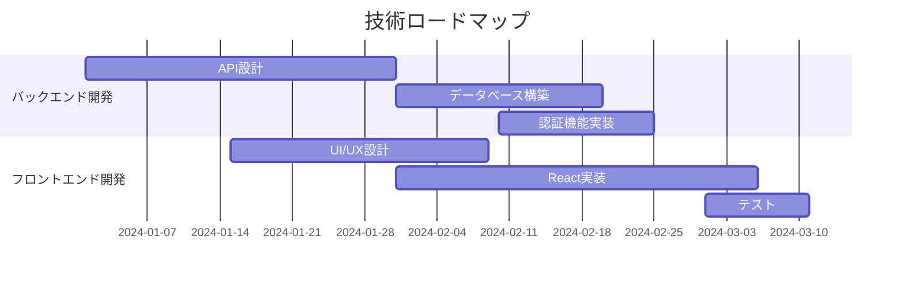

## 第 6 章：技術ロードマップの作成と共有

### 6.1 企業の成長戦略に沿った技術ロードマップの策定

#### 概要と重要性

技術ロードマップは、組織が将来の目標を達成するために必要な技術開発の道筋を示す戦略的な計画です。単なる技術の羅列ではなく、企業の成長戦略と密接に連携している必要があります。なぜなら、技術はビジネスの成長を加速させるエンジンであり、その方向性を誤れば、投資が無駄になるだけでなく、競争力を失う可能性もあるからです。技術ロードマップを策定することで、組織は将来を見据え、戦略的な意思決定を行い、リソースを効果的に配分することができます。

#### 特徴と利点

技術ロードマップは、以下の特徴と利点があります。

- **戦略的整合性:** 企業の長期的な目標と技術開発の方向性を一致させる。
- **優先順位付け:** 重要な技術開発にリソースを集中させる。
- **コミュニケーションの促進:** 関係者間で共通認識を醸成し、協力体制を築く。
- **リスク管理:** 技術的な課題や潜在的なリスクを早期に特定し、対策を講じる。
- **イノベーションの促進:** 新しい技術やアイデアの探索を奨励し、組織全体の創造性を高める。
- **投資対効果の最大化:** 技術投資の意思決定をサポートし、ROI を向上させる。

#### 事前準備と前提条件

技術ロードマップの策定を開始する前に、以下の準備と前提条件を確認する必要があります。

1.  **企業の成長戦略の理解:** 企業のビジョン、ミッション、および長期的な目標を明確に理解する。
2.  **市場動向の分析:** 業界のトレンド、競合他社の戦略、顧客のニーズを把握する。
3.  **技術評価:** 現在の技術力、強み、弱みを評価する。
4.  **ステークホルダーの特定:** 技術ロードマップに関与する主要な関係者（経営層、開発チーム、営業部門など）を特定する。
5.  **情報収集:** 技術動向に関する情報を収集し、専門家へのヒアリングを行う。

#### 基本的な使い方

技術ロードマップの策定は、一般的に以下の手順で進められます。

1.  **目標設定:** 企業の成長戦略に基づいて、技術ロードマップの目標を明確に定義します。例えば、「3 年以内に市場シェアを 20%拡大する」といった具体的な目標を設定します。
2.  **技術領域の特定:** 目標を達成するために必要な技術領域を特定します。例えば、クラウドコンピューティング、AI、IoT などが考えられます。
3.  **技術要素の分解:** 各技術領域をさらに詳細な技術要素に分解します。例えば、クラウドコンピューティングであれば、IaaS、PaaS、SaaS などが考えられます。
4.  **技術評価:** 各技術要素について、現在の技術レベル、潜在的な可能性、開発の難易度などを評価します。
5.  **ロードマップの作成:** 技術要素の開発スケジュール、必要なリソース、および KPI を設定します。ロードマップは、ガントチャートやタイムライン形式で可視化すると効果的です。
6.  **レビューと改善:** 関係者からのフィードバックを収集し、ロードマップを定期的にレビューし、必要に応じて改善します。

#### 実践的なテクニック

技術ロードマップを効果的に策定するための実践的なテクニックをいくつか紹介します。

- **バックキャスティング:** 将来の目標から逆算して、必要な技術開発のステップを定義します。
- **シナリオプランニング:** 異なる市場環境や技術トレンドを想定し、複数のロードマップを作成します。
- **SWOT 分析:** 強み（Strengths）、弱み（Weaknesses）、機会（Opportunities）、脅威（Threats）を分析し、技術戦略を策定します。
- **技術ポートフォリオ管理:** 複数の技術プロジェクトを評価し、最適な投資配分を行います。
- **アジャイルロードマップ:** 短期的なスプリントとフィードバックループを取り入れ、柔軟にロードマップを修正します。

#### 応用例とユースケース

**ユースケース 1: ソフトウェア開発企業**

あるソフトウェア開発企業は、AI 技術を活用して、顧客体験を向上させるための技術ロードマップを策定しました。まず、顧客のニーズを分析し、AI を活用できる領域（チャットボット、レコメンデーションエンジン、データ分析など）を特定しました。次に、各領域に必要な技術要素（自然言語処理、機械学習、深層学習など）を評価し、開発スケジュールと必要なリソースを見積もりました。ロードマップには、各技術要素の KPI（精度、応答時間、顧客満足度など）が設定され、定期的に進捗状況がレビューされました。

**ユースケース 2: 製造業**

ある製造業企業は、IoT 技術を活用して、工場の生産効率を向上させるための技術ロードマップを策定しました。まず、工場の現状を分析し、改善が必要な領域（設備の稼働状況監視、在庫管理、品質管理など）を特定しました。次に、各領域に必要な IoT 技術（センサー、通信プロトコル、データ分析プラットフォームなど）を評価し、導入スケジュールと必要な投資額を見積もりました。ロードマップには、各技術要素の KPI（設備の稼働率、不良率、在庫回転率など）が設定され、導入効果が定期的に測定されました。

#### トラブルシューティング

技術ロードマップの策定において、よく遭遇する問題とその解決策を以下に示します。

- **目標の曖昧さ:** 目標が曖昧な場合、具体的な技術要素や KPI を定義することが難しくなります。目標を SMART（Specific, Measurable, Achievable, Relevant, Time-bound）に定義し直します。
- **情報の不足:** 技術動向に関する情報が不足している場合、適切な技術要素を選択することが難しくなります。情報収集を徹底し、専門家へのヒアリングを行います。
- **関係者の合意形成の難しさ:** 関係者の意見が対立する場合、ロードマップの策定が遅延する可能性があります。ワークショップを開催し、意見交換を行い、合意形成を促進します。
- **技術的な課題:** 技術的な課題が発生した場合、開発スケジュールが遅延する可能性があります。リスク管理計画を策定し、代替案を用意します。

#### まとめと次のステップ

技術ロードマップは、企業の成長戦略を具現化するための重要なツールです。本セクションでは、技術ロードマップの策定方法、実践的なテクニック、およびトラブルシューティングについて解説しました。次のステップとして、自社の状況に合わせて技術ロードマップを作成し、関係者と共有することをお勧めします。

### 6.2 ロードマップを可視化するツールとテクニック

#### 概要と重要性

技術ロードマップは、情報を効果的に伝達し、関係者間の共通認識を醸成するために、視覚的に表現することが重要です。可視化ツールとテクニックを活用することで、ロードマップの内容を理解しやすくし、意思決定を支援し、進捗状況を追跡することができます。単に表計算ソフトで作成するだけでなく、専用のツールやテクニックを活用することで、より洗練された、分かりやすいロードマップを作成できます。

#### 特徴と利点

ロードマップの可視化には、以下の特徴と利点があります。

- **理解の促進:** 複雑な情報を視覚的に表現することで、関係者の理解を深める。
- **コミュニケーションの円滑化:** 関係者間で共通の認識を形成し、効果的なコミュニケーションを促進する。
- **意思決定の支援:** ロードマップに基づいて、戦略的な意思決定を行う。
- **進捗状況の追跡:** ロードマップの進捗状況を可視化し、遅延や問題を早期に発見する。
- **プレゼンテーションの強化:** ロードマップを魅力的なビジュアルで表現することで、プレゼンテーションの効果を高める。

#### 事前準備と前提条件

ロードマップを可視化する前に、以下の準備と前提条件を確認する必要があります。

1.  **ロードマップの完成:** ロードマップの内容（目標、技術要素、スケジュール、リソースなど）が明確に定義されていること。
2.  **可視化ツールの選定:** ロードマップの目的、規模、および関係者のニーズに合わせて、適切な可視化ツールを選択する。
3.  **データの準備:** ロードマップのデータを整理し、可視化ツールに入力できる形式に変換する。
4.  **デザインの検討:** ロードマップのデザイン（色、フォント、レイアウトなど）を検討し、視覚的な効果を高める。

#### 基本的な使い方

ロードマップの可視化は、一般的に以下の手順で進められます。

1.  **ツールの選択:** 適切な可視化ツールを選択します。後述しますが、様々なツールが存在します。
2.  **データの入力:** ロードマップのデータを可視化ツールに入力します。
3.  **グラフの作成:** 可視化ツールを使用して、ロードマップをグラフ化します。ガントチャート、タイムライン、ツリーマップなど、さまざまなグラフ形式を選択できます。
4.  **カスタマイズ:** グラフのデザインをカスタマイズし、視覚的な効果を高めます。色、フォント、レイアウトなどを調整します。
5.  **共有:** 完成したロードマップを関係者と共有します。PDF、画像、またはオンラインで共有できます。

#### 実践的なテクニック

ロードマップを効果的に可視化するための実践的なテクニックをいくつか紹介します。

- **ガントチャート:** プロジェクトのスケジュールを視覚的に表現します。タスク、期間、依存関係などを明確に表示します。
- **タイムライン:** イベントの発生順序を視覚的に表現します。過去、現在、未来の出来事を時間軸に沿って表示します。
- **ツリーマップ:** 階層構造を持つデータを視覚的に表現します。カテゴリ、サブカテゴリ、要素などを階層的に表示します。
- **ネットワーク図:** 関係性を持つデータを視覚的に表現します。ノード、エッジ、および接続強度などを表示します。
- **ダッシュボード:** 複数の KPI を視覚的に表現します。グラフ、チャート、および数値指標などを組み合わせて表示します。

#### 応用例とユースケース

**ユースケース 1: プロジェクトマネジメント**

プロジェクトマネージャーは、ガントチャートを使用して、プロジェクトのスケジュールを可視化しました。タスク、期間、依存関係などを明確に表示し、進捗状況を追跡しました。遅延が発生したタスクを特定し、迅速に対策を講じることができました。

**ユースケース 2: 製品開発**

製品開発チームは、タイムラインを使用して、製品のロードマップを可視化しました。新機能のリリース予定、技術的なマイルストーン、および市場投入時期などを時間軸に沿って表示しました。関係者間で共通の認識を形成し、スムーズな製品開発を実現しました。

**具体的なツール例:**

- **Asana, Trello, Jira:** プロジェクト管理ツールとして、ロードマップ機能を持つものが多いです。タスク管理と連動して進捗を可視化できます。
- **Roadmunk, ProductPlan:** ロードマップ専用ツールです。ガントチャート、タイムライン、ポートフォリオビューなど、豊富な可視化機能を提供します。
- **Microsoft Project, Smartsheet:** 高度なプロジェクト管理ツールです。複雑な依存関係やリソース管理が必要な場合に適しています。
- **Google Slides, PowerPoint:** プレゼンテーションツールですが、シンプルなロードマップであれば十分に作成可能です。インフォグラフィックのような表現も得意です。
- **Miro, Lucidchart:** オンラインホワイトボードツールです。自由なレイアウトでロードマップを作成でき、コラボレーションにも適しています。

**コード例（mermaid.js）：**

Mermaid.js は、テキストベースで図を作成できるライブラリです。Markdown でロードマップを記述し、自動的に図を生成できます。

このコードを Mermaid.js 対応のエディタやウェブサイトでレンダリングすると、ガントチャートが表示されます。

**設定例（Roadmunk）：**

Roadmunk は、ロードマップ専用ツールであり、非常に豊富な機能を持っています。

1.  **アカウント作成:** Roadmunk のウェブサイトでアカウントを作成します。
2.  **新規ロードマップ作成:** ダッシュボードから「Create Roadmap」を選択します。
3.  **テンプレート選択:** 用途に合ったテンプレートを選択します（例: Product Roadmap）。
4.  **データの入力:** ロードマップの要素（目標、イニシアチブ、エピック、タスクなど）を入力します。
5.  **タイムライン設定:** 各要素の開始日と終了日を設定します。
6.  **可視化:** タイムラインビュー、レーンビュー、ポートフォリオビューなど、さまざまな形式でロードマップを可視化します。
7.  **共有:** 関係者とロードマップを共有します。

#### トラブルシューティング

ロードマップの可視化において、よく遭遇する問題とその解決策を以下に示します。

- **ツールの使いこなしの難しさ:** 可視化ツールによっては、操作が複雑で使いこなせない場合があります。チュートリアルやドキュメントを参照し、操作方法を習得します。
- **データの入力ミス:** データの入力ミスがあると、ロードマップの正確性が損なわれます。入力データを慎重に確認します。
- **デザインの不備:** デザインが不適切だと、ロードマップが見にくくなる可能性があります。デザインの原則を学び、視覚的な効果を高めます。
- **情報の過多:** 情報が多すぎると、ロードマップが混乱する可能性があります。情報を整理し、重要な要素に絞り込みます。

#### まとめと次のステップ

ロードマップの可視化は、情報を効果的に伝達し、関係者間の共通認識を醸成するために不可欠です。本セクションでは、ロードマップの可視化ツールとテクニックについて解説しました。次のステップとして、自社のニーズに合った可視化ツールを選択し、ロードマップを効果的に可視化することをお勧めします。

### 6.3 関係者への効果的なロードマップ共有とフィードバック収集

#### 概要と重要性

技術ロードマップは、関係者間で共有され、フィードバックを収集することで、より洗練され、実行可能な計画となります。効果的な共有とフィードバック収集は、関係者のコミットメントを高め、潜在的な問題を早期に発見し、ロードマップの成功に不可欠です。共有は単なる情報伝達ではなく、関係者との対話を通じて、共通理解を深めるプロセスです。

#### 特徴と利点

ロードマップの共有とフィードバック収集には、以下の特徴と利点があります。

- **関係者のコミットメント向上:** 関係者がロードマップの策定に関与することで、オーナーシップと責任感が向上する。
- **潜在的な問題の早期発見:** 関係者からのフィードバックを通じて、技術的な課題、市場の変化、リソースの制約など、潜在的な問題を早期に発見できる。
- **ロードマップの質の向上:** 関係者の専門知識や経験を活用することで、ロードマップの質を向上させることができる。
- **意思決定の透明性向上:** ロードマップの共有を通じて、意思決定のプロセスを透明化し、関係者の信頼を得ることができる。
- **部門間の連携強化:** 関係者が異なる部門から参加することで、部門間の連携を強化し、組織全体の効率性を向上させることができる。

#### 事前準備と前提条件

ロードマップを共有し、フィードバックを収集する前に、以下の準備と前提条件を確認する必要があります。

1.  **共有先の選定:** ロードマップに関与する可能性のある関係者（経営層、開発チーム、営業部門、顧客など）を特定する。
2.  **共有方法の検討:** 関係者のニーズや状況に合わせて、適切な共有方法（会議、プレゼンテーション、オンラインドキュメントなど）を検討する。
3.  **フィードバック収集方法の検討:** 関係者からのフィードバックを効果的に収集するための方法（アンケート、インタビュー、ワークショップなど）を検討する。
4.  **コミュニケーション計画の策定:** ロードマップの共有とフィードバック収集に関するコミュニケーション計画を策定する。

#### 基本的な使い方

ロードマップの共有とフィードバック収集は、一般的に以下の手順で進められます。

1.  **共有:** ロードマップを関係者に共有します。会議、プレゼンテーション、オンラインドキュメントなど、適切な方法を選択します。
2.  **説明:** ロードマップの内容、目標、戦略、および KPI を明確に説明します。関係者の理解を深めるために、視覚的な資料（グラフ、チャート、図など）を活用します。
3.  **質問:** 関係者からの質問を受け付けます。質問に丁寧に回答し、不明な点を解消します。
4.  **フィードバック収集:** 関係者からフィードバックを収集します。アンケート、インタビュー、ワークショップなど、適切な方法を選択します。
5.  **分析:** 収集したフィードバックを分析します。肯定的な意見、否定的な意見、および改善提案などを整理します。
6.  **改善:** 分析結果に基づいて、ロードマップを改善します。変更内容を関係者に共有し、承認を得ます。

#### 実践的なテクニック

ロードマップの共有とフィードバック収集を効果的に行うための実践的なテクニックをいくつか紹介します。

- **ターゲットオーディエンスの特定:** ロードマップを共有する相手に応じて、内容や表現方法を調整します。経営層には戦略的な視点を強調し、開発チームには技術的な詳細を説明します。
- **ストーリーテリング:** ロードマップの背景、目的、および期待される成果をストーリーとして語ります。感情に訴えかけ、関係者の共感を呼び起こします。
- **インタラクティブなプレゼンテーション:** 一方向的なプレゼンテーションではなく、質疑応答やディスカッションを取り入れ、インタラクティブなコミュニケーションを促進します。
- **フィードバックの構造化:** フィードバックを収集する際に、質問の形式を明確にし、回答の選択肢を提示します。これにより、フィードバックの収集と分析が容易になります。
- **フィードバックの可視化:** 収集したフィードバックをグラフやチャートで可視化し、傾向やパターンを把握します。これにより、改善の優先順位を決定しやすくなります。
- **継続的なコミュニケーション:** ロードマップの進捗状況を定期的に関係者に共有し、フィードバックを継続的に収集します。これにより、関係者の関心を維持し、ロードマップの成功を支援します。

#### 応用例とユースケース

**ユースケース 1: 新製品開発**

ある企業は、新製品開発のロードマップを関係者に共有しました。市場調査の結果、顧客のニーズ、および競合製品の分析に基づいて、製品のコンセプト、機能、および価格を設定しました。ロードマップには、開発スケジュール、マーケティング戦略、および販売計画が含まれていました。関係者からのフィードバックを収集し、製品のコンセプトを改善し、マーケティング戦略を調整しました。結果として、新製品は市場で成功を収めました。

**ユースケース 2: デジタル transformation**

ある企業は、デジタル transformation のロードマップを関係者に共有しました。企業の現状、目標、および戦略に基づいて、IT インフラの刷新、業務プロセスの改善、および人材育成の計画を策定しました。ロードマップには、KPI（売上高、顧客満足度、生産性など）が設定され、定期的に進捗状況がレビューされました。関係者からのフィードバックを収集し、計画を修正し、デジタル transformation を成功させました。

**具体的な共有方法:**

- **全社説明会:** 大規模な組織で、ロードマップの概要を広く周知する場合に有効です。
- **部門別会議:** 各部門の責任者や担当者を集め、ロードマップの詳細を説明し、意見交換を行います。
- **1on1 ミーティング:** 個別の関係者と個別に会い、ロードマップに関する意見を聞き、懸念事項を解消します。
- **社内 Wiki, ドキュメント共有ツール:** Confluence, Notion, Google Docs などでロードマップを公開し、いつでもアクセスできるようにします。コメント機能を使ってフィードバックを収集します。
- **アンケート:** SurveyMonkey, Google Forms などを使って、ロードマップに関するアンケートを実施します。定量的なデータを収集するのに有効です。

**フィードバック収集の質問例:**

- ロードマップの目標は明確ですか？
- ロードマップの戦略は妥当ですか？
- ロードマップの KPI は適切ですか？
- ロードマップのリスクは十分に考慮されていますか？
- ロードマップの実行可能性は高いですか？
- ロードマップに対する懸念事項はありますか？
- ロードマップに対する改善提案はありますか？

#### トラブルシューティング

ロードマップの共有とフィードバック収集において、よく遭遇する問題とその解決策を以下に示します。

- **関係者の無関心:** 関係者がロードマップに関心を示さない場合、ロードマップの重要性やメリットを十分に説明できていない可能性があります。ロードマップが関係者の仕事や目標にどのように貢献するかを明確に説明します。
- **フィードバックの不足:** 関係者からのフィードバックが少ない場合、フィードバックの収集方法が適切でない可能性があります。アンケート、インタビュー、ワークショップなど、さまざまな方法を試します。
- **フィードバックの質の低さ:** 関係者からのフィードバックの質が低い場合、関係者がロードマップの内容を十分に理解していない可能性があります。ロードマップの内容を丁寧に説明し、質問を受け付けます。
- **フィードバックの分析の難しさ:** 収集したフィードバックの分析が難しい場合、フィードバックの形式が統一されていない可能性があります。フィードバックの形式を統一し、分析しやすいように構造化します。

#### まとめと次のステップ

ロードマップの共有とフィードバック収集は、ロードマップの成功に不可欠です。本セクションでは、ロードマップの共有とフィードバック収集の方法、実践的なテクニック、およびトラブルシューティングについて解説しました。次のステップとして、ロードマップを関係者に共有し、フィードバックを収集し、ロードマップを改善することをお勧めします。ロードマップは一度作って終わりではなく、継続的に改善していくことで、より効果的な戦略的な計画となります。
